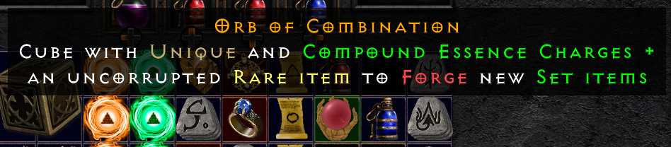

## Skills

- most skills have been reworked, rebalanced or replaced with more useful skills

## Corruptions

- Collect Glyphs to corrupt and imbue items with sockets, additional properties at the chance of ruining the item

- Two different types of corruptions: combat-oriented (Perfect Ruby) and caster-oriented (Perfect Sapphires)

- Collect Larzuk's Gimlets to roll sockets on any weapon or armor

## Crafting

- Completely rebalanced crafting to make every recipe viable
- Added Skulls for leech crafting and topaz for magic find crafting recipes

- Collect Baubles and charge them with jewels, runes and P gems.
- Extract Bauble Charges for quicker and smarter crafting.

## Rerolling items

- Use Orbs of Extraction to extract essences from uniques and set items 
- Use Orbs of Divination to reroll unique items for greater reusability

## New items

- New normal, exceptional and elite armors that help out shapeshifters

## Forging set and unique items

- Use new Orbs of Combination with Essences to forge new unique and set items. The items will be denoted "Forged by Hand" and have slightly penalized attributes. Very useful if you want to try out a build or just want to get started. 

<!---  --->

<!---  --->

## New Charms

- Each new character now starts with a personalized "Valor" charm; these can also be bought from vendors
- With a single charm, your character now has more room for loot

- New Valor charms can be infused using new Biddings, with similar attributes as old charms

- Valors can only be upgraded 30-40 times, so use the infusions well!
- Use the Valor charms to completely tailor-make your character build and use them as leveling devices

- Sunder Charms now need to be crafted from Obsidian, and can be infused with strong attributes using Blood Biddings

## Updated automagic attributes to lesser used items
- Armors are now divided into light, caster, and heavy armors.

- Throwing knives and daggers deal deadly strike

- All shields can spawn with higher block or faster block rate. Smaller shields have faster block per default

- Staves contain more defensive and offensive attributes

- Claws and small shields now contain "Chance to not consume charges" for Assassin

## New inventory, stash and Horadric Cube

- Increased Inventory size and updated to 8 shared tabs. 

- Horadric Cube size has been increased

## New set attributes and changed around lower set items 

## Item updates and QoL

- Melee items now deal Area Attack (splash) based on base item damage (for easier melee leveling). Onehanded melee weapons deal damage in an arc, while twohanded weapons deal damage in a radius.

- Melee damage has been buffed by 125% on exceptional and elite weapons across the board

- Jewels can be be cubed into minor Jewel Fragments, and they stack!

- Rare items increase number of affixes

- Descriptions on gems, runes and other stackables for ease of access

