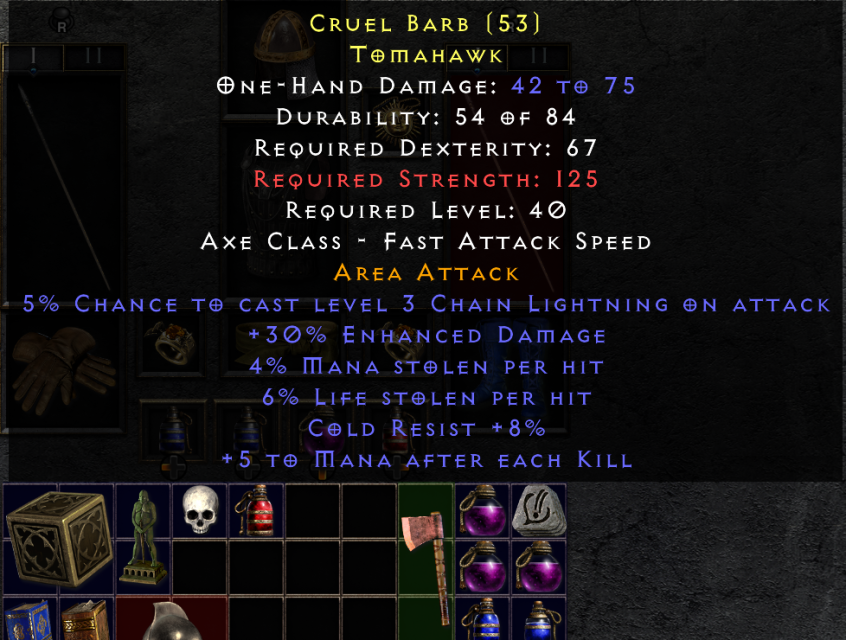

## Corruptions

- Collect Glyphs to corrupt and imbue items with sockets, additional properties at the chance of ruining the item
- Two different types of corruptions: combat-oriented (Perfect Ruby) and caster-oriented (Perfect Sapphires)
- Collect Larzuk's Gimlets to roll sockets on any weapon or armor

## Crafting

- Completely rebalanced crafting to make every recipe viable
- Added Skulls for leech crafting and topaz for magic find crafting recipes

## Rerolling items

- Use Orbs of Extraction to extract essences from uniques and set items 
- Use Orbs of Divination to reroll unique items for greater reusability

## Forging set and unique items

- Use new Orbs of Combination with Essences to forge new unique and set items. The items will be denoted "Forged by Hand" and have slightly penalized attributes. Very useful if you want to try out a build or just want to get started. 

## New Valor Charm

- Each new character now starts with a personalized "Valor" charm; these can also be bought from vendors
- With a single charm, your character now has more room for loot

- New Valor charms can be infused using new Biddings, with similar attributes as old charms

- Valors can only be upgraded 30-40 times, so use the infusions well!
- Use the Valor charms to completely tailor-make your character build and use them as leveling devices

## Updated automagic attributes to lesser used items
- Armors are now divided into light, caster, and heavy armors.

- Throwing knives and daggers deal deadly strike

- All shields can spawn with higher block or faster block rate. Smaller shields have faster block per default

- Staves contain more defensive and offensive attributes

## New inventory, stash and Horadric Cube

- Increased Inventory size and updated to 8 shared tabs. 

- Horadric Cube size has been increased

## New set attributes and changed around lower set items 

## Item updates and QoL

- Melee items now deal Area Attack (splash) based on base item damage (for easier melee leveling)

- Jewels can be be cubed into minor Jewel Fragments, and they stack!

- Rare items increase number of affixes

- Descriptions on gems, runes and other stackables for ease of access

