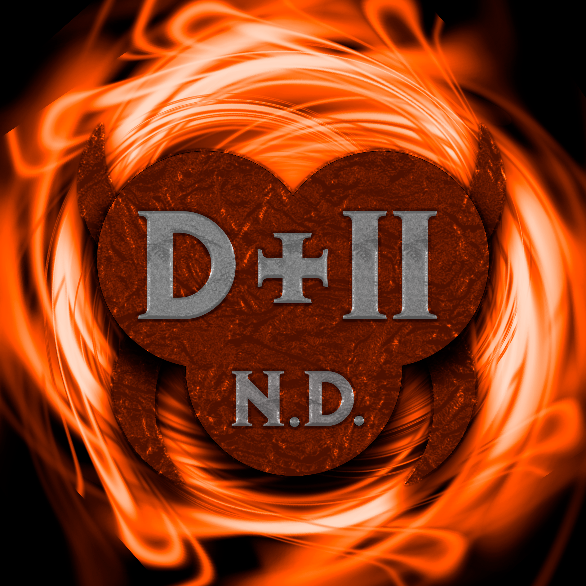

# Diablo 2 Never Dies (D2ND)
A Diablo II Resurrected Mod

Looking for a way to level up your Diablo 2 Resurrected experience? Our mod has got you covered! We've implemented much-needed Quality of Life changes that will make your gameplay smoother and more enjoyable. Whether you're a casual gamer with limited time or a hardcore player who loves to create multiple characters and builds, our mod is balanced to suit your needs.

We've buffed underused skills and item types, so you can try out new builds and play styles. Plus, you'll find rare items that will help you reach endgame, and you can even forge unique items and set items as you progress. Beware though, they come at a cost when not found yourself!

Get ready for an exciting and rewarding journey through Diablo 2 Resurrected with our mod!

## Get ready for an ecosystem of loot
Get ready to dive into an exciting world of loot with our mod's ecosystem of loot! We understand that one of the most thrilling aspects of D2 is the rush of finding more and better loot. That's why we've drastically improved drop chances for single-player mode. You'll find enough unique items to keep things interesting, but not so much that you'll be overwhelmed with loot that fills up your screen.

And when it comes to loot, balance is key. Our mod is designed with Hardcore play in mind, though Softcore players can still have a blast. We've introduced higher difficulties in both Nightmare and Hell, so you'll have plenty of opportunities to put your gear to the test. While losing a character to a random death is never fun, you can quickly rebuild with mid-level gear and jump right back into the action. 

## Leveling and trying new builds
Leveling up and experimenting with new builds has never been more thrilling! Our mod has increased Normal and Nightmare difficulties in a variety of ways, adding more loot and more risks. All modes feature higher resistance penalties, doubled monster density, and tripled unique monster spawns.

## Enhancing items with risks
But that's not all - we've also enhanced items with risks, adding multiple possibilities to attain better items. You can reroll unique items with divination orbs and essence charges, forge your own uniques and set items at a cost and with a chance of receiving penalty stats, or even corrupt your items with crafting corruptions or combat corruptions, with the risk of bricking your item into a rare item.

## Making room for loot and configuring the character
And finally, we've made room for loot and configuring the character easier by introducing unique, character-specific "Valor" charms, which can be upgraded as you go by finding "Biddings". These scrolls of magical powers empower your character as you level up, adding new item-granted powers and skill trees. But be warned - you can't remove powers from a Valor charm, so you'll have to make some tough choices as you move forward in your quest. Get ready to level up and experiment with new builds like never before with our exciting mod!
